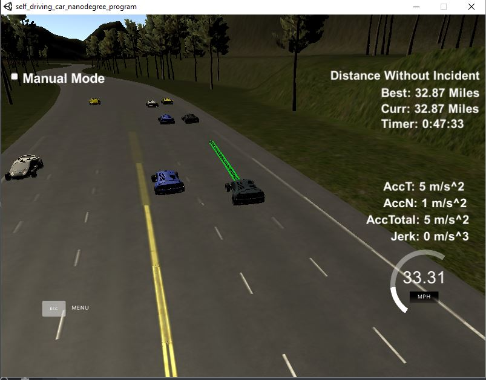

# Udacity SDCND - Path Planning Project #  




### Model Documentation ###
<hr>  
<hr>

**I. Overview** :  

I have used a simple approach which builds on the model shown in the Q&A video.  
The overall logic can be described as below
1. Try to drive at the optimum speed
2. If there is a vehicle ahead of the ego car, slow down and attempt to change lanes
  - Check which lane(s) are adjacent
  - For all adjacent lanes, determine which one has maximum distance to the nearest vehicle
  - Switch to the chosen lane
3. If lane cannot be changed, slow down to the lead vehicle's velocity
4. Repeat  

<hr>


**II. Global Variables and Constants** : `Lines 16 - 23`  

Constants are declared to fix the speed limit, buffer speed and lane width.  
Variables are declared to keep track of the current driving speed and current lane.

```cpp
// Global variables and constants
double const speed_limit_mph = 50.0;
double const buffer_speed_mph = 4.0;
int const lane_width_frenet = 4;

double desired_speed_mph;
double drive_speed_mph = 0;
int lane = 1;
```  

<hr>


**III. Utilising the previous trajectory** : `Lines 350 - 359`  

If it's not the first run and some un-used points exist from the previous trajectory, the ego car's current *s* value is set to the end of the projected path.  
Then, the un-used points are added to the next trajectory to ensure a smooth transition.

```cpp
// Set the ego car's location to the end of the previous trajectory
if(path_size > 0) {
    car_s = end_path_s;
}

// Re-use the points from the previous path that are not traversed
for(int i = 0; i < path_size; i++)
{
        next_x_vals.push_back(previous_path_x[i]);
        next_y_vals.push_back(previous_path_y[i]);
}
```  

<hr>


**IV. Detecting a leading vehicle in the same lane** : `Lines 396 - 418`  

Using the sensor fusion data, the code cycles through each vehicle to determine if it is in the same lane as the ego vehicle. This is done using the helper method **isSameLane()**.  
If there is a vehicle in the same lane, the helper method **getTrafficData()** is used to extract the traffic vehicle's *s* and *speed* values and project them into the future. Using these, it is determined if the vehicle is going to be within 30 m. of the ego vehicle - thus triggering the lane change flag.  

```cpp
// Initial assumption that there is no leading traffic vehicle
flag_slow_down_required = false;
desired_speed_mph  = speed_limit_mph - buffer_speed_mph;

// Check if there is a vehicle in front of the ego car
for(int i = 0; i < sensor_fusion.size(); i++)
{
    double traffic_d = sensor_fusion[i][6];
    if(isSameLane(lane, traffic_d))
    {
        // Retrieve traffic vehicle's s and speed
        vector<double> traffic_data = getTrafficData(sensor_fusion[i], path_size);

        if((traffic_data[0] > car_s) && ((traffic_data[0] - car_s)<=30))
        {
            if(desired_speed_mph > traffic_data[1])
            {
                flag_slow_down_required = true;
                desired_speed_mph = traffic_data[1];
            }
        }
    }
}
```  

<hr>


**V. Decision making for the lane change** : `Lines 421 - 516`  

Three variables are maintained to keep track of the closest vehicle on each lane.  
```cpp
double left_lane_min_dist = 9999;
double right_lane_min_dist = 9999;
double center_lane_min_dist = 9999;
```

By using the current lane number, it can be determined for which lanes the vehicles need to be checked. Below is the code sample for checking the center lane. Once again, the helper methods **isSameLane()** and **getTrafficData()** are used to obtain the distance of the closest vehicle in the same lane.

```cpp
// Check center lane if currently the ego vehicle is in the left/right lanes
if(lane!= 1) {

    // Check if there is a vehicle in the center lane
    for(int i = 0; i < sensor_fusion.size(); i++)
    {
        double traffic_d = sensor_fusion[i][6];
        if(isSameLane(1, traffic_d))
        {
            // Retrieve traffic vehicle's s and speed
            vector<double> traffic_data = getTrafficData(sensor_fusion[i], path_size);

            // Check how close the traffic vehicle will be to the ego vehicle
            double min_dist = fabs(traffic_data[0] - car_s);
            if(min_dist < center_lane_min_dist)
            {
                center_lane_min_dist = min_dist;
            }

        }

    }

}
```   

Lastly, the three variables with the minimum distances and the current lane is passed to the helper method **getNextLane()** which returns the optimum lane to change to. It will return the current lane if a lane change is not possible.

```cpp
// Change lanes if possible
int new_lane = getNextLane(lane, left_lane_min_dist, center_lane_min_dist, right_lane_min_dist);


// Slow down if changing lanes
if((new_lane != lane) && (drive_speed_mph > 40))
{
    drive_speed_mph -= 0.224 * 2;;
}

lane = new_lane;
}
```  

<hr>


**VI. Generating waypoints for the spline** : `Lines 520 - 530`  

First, the last two points of the previous trajectory are used to fit the spline. If these are not available, the car's current position is used.

The next set of points is generated on the new lane to ensure a smooth lane transition. 4 points are used and each are 25 m. apart.

```cpp
// Create more target waypoints to add to the spline initialization
int num_waypoints = 4;
double dist_waypoints = 25;
for (int i = 0; i < num_waypoints; i++) 
{
    vector<double> add_waypoint = getXY(car_s + (i+1)*dist_waypoints,
                                        (lane_width_frenet*lane + (lane_width_frenet/2)), 
                                        map_waypoints_s, map_waypoints_x, map_waypoints_y);

    ptsx.push_back(add_waypoint[0]);
    ptsy.push_back(add_waypoint[1]);
}
```  

<hr>


**VII : Sampling points on the spline** : `Lines 547 - 581`  

Here, I have used the code and approach introduced during the Q&A video. It utilises the equation  
```double N = target_dist/(0.02 * drive_speed_mph / 2.24); ``` to find the distance between each point to be sampled.  
The target horizon distance is set to 30 m.

<hr>


**VIII. Helper Methods**

**isSameLane()**  - `Lines 181 - 194`
    
    This method simply determines if a given *s* value is within a +/- 2 range of center of a given lane.  
    Below is a snippet.  
        
```cpp
if (abs((traffic_d - (ego_lane*lane_width_frenet + lane_width_frenet/2))) <=2)
{
    return true;
}
```


**getTrafficData()** - `Lines 196 - 209`

    The method is given the sensor fusion data and the number of points un-used in the previous trajectory.  
    This method returns the projected *s* and *speed* values of the traffic vehicle.  
    Below is a snippet.  
    
```cpp
//Predicting where the car will be in the future
traffic_s += (double)path_size*0.02*traffic_speed;

vector<double> traffic_data = {traffic_s, traffic_speed};
return traffic_data;
```


**getNextLane()** - `Lines 211 - 260`

    This method simply checks which lanes are valid to change to (adjacency).  
    It also determines which one is the safest (distance to nearest vehicle).  
    Below is a snippet.  

```cpp
// If in left or right lane, check if moving to center lane is safe
if(lane != 1)
{
    if(center<30){

        // Lane change is not possible
        return lane;
    }
    else{

        // Change to center lane
        return 1;
    }
}
```

<hr>

